# Size, Design, and Test a Thermal Management System for a Vehicle

*Keywords: thermal system sizing, thermal system design, thermal system digital twin, BEV or HEV system-level design, energy management studies*

*Target audience: Automotive engineers that are involved in system-level design and are not familiar with refrigeration or temperature-controlled system design (for instance, engineers with a mechanical or electrical background)*

[](https://matlab.mathworks.com/open/github/v1?repo=Florin-Nae/design-and-test-a-thermal-management-system-for-a-vehicle&project=https://github.com/Florin-Nae/design-and-test-a-thermal-management-system-for-a-vehicle/blob/main/VehicleThermalSystemSizing.prj&file=https://github.com/Florin-Nae/design-and-test-a-thermal-management-system-for-a-vehicle/blob/main/VehicleThermalSystemSizing_start.mlx)

The target audience is an automotive engineer that is involved in system-level design and is not familiar with refrigeration or cooling system design. The modeling is based on energy and mass flow rates, not on geometry (for example, the heat exchangers are modelled as system-level components that do not need number of tubes, fins area, etc.). The goal of the model is to be used as a **virtual testbench that can be used to determine the size of the system components**  (and then, for instance, using supplier parts catalogues to select appropriate components).

The demo explains how to:

* First, design a refrigeration loop for a passenger vehicle based on cooling power requirements (for details, refer to [**designHVACsystem**](https://htmlpreview.github.io/?https://github.com/Florin-Nae/design-and-test-a-thermal-management-system-for-a-vehicle/edit/main/RefrigerationSystemSizing/designHVACsystem.html) MATLAB<sup>®</sup> Live Script)

* Next, include the refrigeration system in a larger thermal management system. The final system includes the vehicle cabin, a chiller that interfaces with a water-based cooling circuit, and the water-based cooling circuit itself, thus creating a more realistic model of a vehicle thermal management system (for details, refer to [**VehicleThermalSystemSizing_start**](./VehicleThermalSystemSizing_start.html) MATLAB<sup>®</sup> Live Script). 

Hopefully this example will help an engineer understand how to properly size, design, and test a system-level thermal system model for a BEV, HEV, or a conventional vehicle, by using a virtual testbench. 

The workflow of the example is summarized in the figure below.


## STEP 1: Download the submission

* Use the repository path above and clone it to a local PC directory to save the project files, or 

* Get a local copy of the project directly from MATLAB<sup>®</sup>, by using Simulink<sup>®</sup> ➡ Project from Git, or

* Open the project directly from the browser, by clicking on the MATLAB<sup>®</sup> Online<sup>TM</sup> logo at the top of this page

Start the MATLAB<sup>®</sup> project by clicking on the file *VehicleThermalSystemSizing.prj*

## STEP 2: Design a simple HVAC system

Use the following MATLAB® Live Script (for reference, the HTML exported from the Live Script file is [here](./RefrigerationSystemSizing/designHVACsystem.html)):

```Matlab
designHVACsystem;
```

This example shows how to design a basic HVAC cooling system for a vehicle cabin (or an arbitrary closed volume). This example was inspired by the published documentation example [Model a Refrigeration Cycle](https://www.mathworks.com/help/hydro/ug/modeling-a-refrigeration-cycle.html), but is significantly more focused on engineering aspects and is providing more details for automotive engineers not familiar with refrigeration system design. 

Contents:

1. [Preliminary Considerations](#problem-to-solve)
2. [Refrigeration Circuit Primer](#refrigeration-circuit-primer)
3. [Define the Operating Range of the Refrigeration Cycle](#define-the-operating-range-of-the-refrigeration-cycle)
4. Set Up the Evaporator Test Harness <sup>(1)</sup>
5. Set Up the Thermostatic Expansion Valve Test Harness <sup>(1)</sup>
6. Set Up the Condenser Test Harness <sup>(1)</sup>
7. Create a Model of the Open-Loop System <sup>(1)</sup>
8. [Create a Model of the Closed-Loop System](#create-a-model-of-the-closed-loop-system)

<sup>(1)</sup>  We do not discuss these test models here, please directly check the project folder and open the Simulink<sup>®</sup> models. Or open and check the contents of the MATLAB<sup>®</sup> Live Script [**designHVACsystem**](./RefrigerationSystemSizing/designHVACsystem.html).

### Problem to Solve

Problem to solve:  

* Assume we want to cool a vehicle cabin and its volume is 4 m<sup>3</sup>.
* Suppose the external temperature is 30 °C and the volume desired temperature is 22 °C, and we want to cool down the cabin temperature in 1 min.
* For simplicity, we assume that the air is dry, there are no losses in the system, and the cabin does not exchange heat with the surroundings. For a more detailed analysis, that considers air moisture and latent heat, one can refer to the MATLAB<sup>®</sup> Live Script [**Rough_design_of_a_thermal_system**](./Rough_design_of_a_thermal_system.html) which is an example of leveraging ChatGPT to quickly get a ballpark figure for the thermal system cooling power.

```matlab
% Environment
T_env = 30; % [degC] External environment temperature
RH_env = 0.5; % External environment relative humidity

% Set nominal cooling temperature of the refrigeration system
T_set = 22; % [degC] Thermostat set point
```

We can estimate the heat load on the system by using following formula:

*Heat Load (Q) = Volume × Density × Specific Heat × Temperature Difference*

Where:
Volume = 4 cubic meters  
Density of air = approximately 1.225 kg/m^3  
Specific heat of air = approximately 1.005 kJ/kg·°C  
Temperature Difference = (Desired Temperature - External Temperature) = (22°C - 30°C)  
Let's calculate:
Temperature Difference = (22°C - 30°C) = -8°C  

*Heat Load (Q)* = 4 m^3 × 1.225 kg/m^3 × 1.005 kJ/kg·°C × (-8°C) ≈ -39 kJ  

Since we're dealing with cooling, the negative sign indicates heat removal.
Suppose we want to cool down the volume in 1 min = 60 s.
The needed cooling power (that is, the heat flow rate) will be   

*Heat Flow Rate (Q)* = *Heat Load (Q)* kJ / 60 s ≈ 0.65 kW.   

How much refrigerant mass flow rate is needed for this heat flow rate?  
Assume the refrigerant as R410a. To calculate the mass flow rate, we can use the specific heat capacity of the refrigerant R410a and the heat flow rate of the refrigerant. 
The specific heat capacity of R410a is approximately 1.87 kJ/kg·°C.

*Mass Flow Rate = Heat Flow Rate (Q)/(Specific Heat Capacity × Temperature Difference)*  

Given:  
Heat Flow Rate (*Q*) = 0.65 kW  
Specific Heat Capacity of R410a = 1.87 kJ/kg·°C  
Temperature Difference = (Desired Temperature - External Temperature) = (22°C - 30°C) = -8°C  
Let's calculate:  

*Mass Flow Rate* = 0.65 kW /( 1.87 kJ/kg·°C × (-8°C)) ≈ 0.04 kg/s  

In practice we need to assume a higher cooling capacity, to account for system losses (losses in the pipes, heat exchangers, etc.) and for cooling of additional components in addition to the cabin, for instance cooling the components of an BEV or HEV car (batteries, DC/DC, inverter, motors, etc.). As an example, suppose we need a heat exchanger between R410a refrigeration loop and a water circuit, to cool the HV batteries used by and BEV or HEV, and we need to determine the heat transfer rate for this heat exchanger. 
Based on the heat transfer rate, we can select an appropriate heat exchanger design. 

Calculate the Heat Transfer Rate:   

*Q = mdot×Cw×(T<sub>inflow</sub>−T<sub>outflow</sub>)*, where:  

*Q* = Heat transfer rate (in kW)  
*mdot* = Mass flow rate of water (in kg/s)  
*Cw* = Specific heat capacity of water (in kJ/kg·°C)  
*T<sub>inflow</sub>* = Inflow temperature of water (in °C)  
*T<sub>outflow</sub>* = Outflow temperature of water (in °C)  
Given:
*Mass flow rate of water* = 0.5 kg/s  
Specific heat capacity of water (*Cw*) = 4.186 kJ/kg·°C (at constant pressure)  
*T<sub>inflow</sub>* = 50°C  
*T<sub>outflow</sub>* = 49°C  
Let's calculate Q:  
*Q* = 0.5 kg/s × 4.186 kJ/kg/°C×(50°C−49°C)=2.09 kW

With these preliminary considerations, we can design the cooling system. Considering the losses in a real system as well as the heat exchanged by the system with the exterior, neglected in the above analysis, we assume that a cooling capacity of 3 kW is needed.

```matlab
% Cooling capacity of the refrigeration system 
CoolingPower_kW = 3;
```

### Refrigeration Circuit Primer

Before delving into design details, here's a basic overview of the thermodynamics involved in the condenser and evaporator of a refrigeration system:  

**Condenser:**  

The high-pressure, high-temperature refrigerant vapor enters the condenser from the compressor.  
Heat from the hot refrigerant vapor is transferred to the surrounding air (in an air-cooled condenser) or to a cooling medium (in a liquid-cooled condenser).  
As the refrigerant releases heat, it undergoes a phase change from vapor to liquid (condensation) while maintaining high pressure.  
The condensed liquid refrigerant leaves the condenser and flows to the expansion valve.  

**Evaporator:**  

The low-pressure, low-temperature liquid refrigerant enters the evaporator from the expansion valve.  
Heat from the surroundings (the space to be cooled) is absorbed by the cold refrigerant liquid.  
As the refrigerant absorbs heat, it undergoes a phase change from liquid to vapor (evaporation) while maintaining low pressure.  
The vaporized refrigerant leaves the evaporator and returns to the compressor to complete the refrigeration cycle.  

**Key Thermodynamic Processes:**  

**Condensation:** Heat is released from the refrigerant vapor as it condenses into a liquid. This heat transfer process occurs at constant pressure.  

**Evaporation:** Heat is absorbed by the refrigerant liquid as it evaporates into a vapor. This heat transfer process also occurs at constant pressure.  

**Latent Heat:** During both condensation and evaporation, the refrigerant undergoes a phase change while absorbing or releasing latent heat without a change in temperature.  

Let's break down the explanation using enthalpy, pressure, vapor quality, and temperature for both the condenser and evaporator:  

**Condenser:**  

*Enthalpy*: Enthalpy is a measure of the total heat content of a substance. In the condenser, the high-pressure, high-temperature refrigerant vapor undergoes a decrease in enthalpy as it releases heat to the surroundings and condenses into a liquid. This process is known as the latent heat of condensation.  
*Pressure*: The pressure in the condenser remains relatively constant throughout the condensation process, as it is designed to maintain the refrigerant at a high pressure to facilitate heat transfer to the surroundings.  
*Vapor Quality*: In the condenser, the refrigerant starts as a superheated vapor with a vapor quality of 1 (100% vapor) and ends as a saturated liquid with a vapor quality of 0 (0% vapor). Vapor quality is a measure of the fraction of vapor in the refrigerant mixture.  
*Temperature*: The temperature of the refrigerant decreases during condensation as heat is transferred to the surroundings. However, the temperature remains relatively constant during the phase change process until all the vapor is condensed into a liquid.  

**Evaporator:**  

*Enthalpy*: In the evaporator, the low-pressure, low-temperature liquid refrigerant absorbs heat from the surroundings and undergoes an increase in enthalpy as it evaporates into a vapor. This process is known as the latent heat of evaporation.  
*Pressure*: The pressure in the evaporator remains relatively constant throughout the evaporation process, as it is designed to maintain the refrigerant at a low pressure to facilitate heat absorption from the surroundings.  
*Vapor Quality*: In the evaporator, the refrigerant starts as a saturated liquid with a vapor quality of 0 and ends as a superheated vapor with a vapor quality of 1. The vapor quality increases as more liquid evaporates into vapor.  
*Temperature*: The temperature of the refrigerant increases during evaporation as it absorbs heat from the surroundings. Similar to condensation, the temperature remains relatively constant during the phase change process until all the liquid is evaporated into vapor.  

In summary, both the condenser and evaporator in a refrigeration system involve changes in enthalpy, pressure, vapor quality, and temperature as the refrigerant undergoes phase changes and heat transfer processes. These thermodynamic properties are crucial for understanding and designing efficient refrigeration systems.  

Let's delve into the mathematics behind the thermodynamic processes in the condenser and evaporator using basic heat transfer principles:  

**Condenser:**  

Enthalpy Change (*ΔH*): The enthalpy change during condensation can be calculated using the formula:   
*ΔH = m×(h<sub>final</sub>−h<sub>initial</sub>)*, where:  
*ΔH* = Enthalpy change (in kJ)  
*m* = Mass flow rate of refrigerant (in kg/s)  
*h<sub>final</sub>* = Enthalpy of saturated liquid refrigerant (in kJ/kg) at condenser outlet conditions  *h<sub>initial</sub>* = Enthalpy of superheated vapor refrigerant (in kJ/kg) at condenser inlet conditions  
Pressure: The pressure drop in the condenser is negligible for most practical purposes. Therefore, the pressure remains approximately constant.  
Vapor Quality (*x*): Vapor quality represents the fraction of vapor in the refrigerant mixture and can be calculated using:   
*x = h-h<sub>f</sub>/(h<sub>g</sub>−h<sub>f</sub>)*, where:  
*x* = Vapor quality  
*h* = Enthalpy of refrigerant mixture  
*h<sub>f</sub>* = Enthalpy of saturated liquid refrigerant  
*h<sub>g</sub>* = Enthalpy of saturated vapor refrigerant   
Temperature: The temperature change during condensation is minimal due to the latent heat of condensation being absorbed by the surroundings. Therefore, the temperature remains relatively constant.  

**Evaporator:**  

Enthalpy Change (ΔH): The enthalpy change during evaporation can be calculated similarly to condensation:  
*ΔH = m×(h<sub>final</sub>−h<sub>initial</sub>)*, where:  
*ΔH* = Enthalpy change (in kJ)   
*m* = Mass flow rate of refrigerant (in kg/s)  
*h<sub>final</sub>* = Enthalpy of superheated vapor refrigerant (in kJ/kg) at evaporator outlet conditions  
*h<sub>initial</sub>* = Enthalpy of saturated liquid refrigerant (in kJ/kg) at evaporator inlet conditions  
Pressure: Similar to the condenser, the pressure in the evaporator remains approximately constant.  
Vapor Quality (*x*): Vapor quality in the evaporator increases as more liquid evaporates into vapor, following the same formula as in the condenser.  
Temperature: The temperature change during evaporation is minimal due to the latent heat of evaporation being absorbed from the surroundings. Therefore, the temperature remains relatively constant.  

These mathematical relationships help in understanding the thermodynamic processes involved in the condenser and evaporator of a refrigeration system.

### Define the Operating Range of the Refrigeration Cycle

Choose the appropriate refrigerant based on the design requirements: The example model uses R-410a refrigeration fluid.
First define the four points of the refrigeration loop on a p-H diagram for that refrigerant. 
To plot fluid property contours on a pressure-enthalpy diagram, right-click on a [Two-Phase Fluid Predefined Properties (2P)](https://www.mathworks.com/help/hydro/ref/twophasefluidpredefinedproperties2p.html) block or a Two-Phase Fluid Properties (2P) block in a Simulink<sup>®</sup> model. **Select Fluids > Plot Fluid Properties (Contours)**. 


Select Enthalpy Axis in the opened figure. The p-H diagram will look like this:


Next, we define the requirements for the refrigeration cycle.

Set the condensing temperature, or the saturation temperature in the condenser, to be higher than the outdoor temperature to enable heat transfer from the refrigerant to the outdoor environment. The example model uses a 45 °C refrigerant temperature to provide a 15 °C temperature difference with ambient.

Set the evaporating temperature, or the saturation temperature in the evaporator, to be lower than the desired indoor temperature to enable heat transfer from the indoor air to the refrigerant. The example model uses a 5 °C evaporator outlet temperature to remove heat from the 22 °C set temperature for the cabin.

To estimate the specific enthalpy end points of the high and low pressure lines in the cycle, set the amount of subcooling at the condenser outlet to be 5 degrees.

Based on above considerations, define operating range of the system as below:

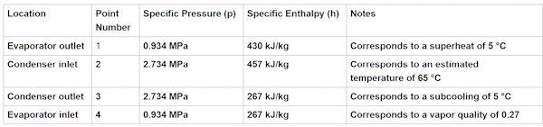

Visualize the operating range by plotting the 4 points on the p-H diagram:

```matlab
% hold on % hold on the axes of the opened p-H plot figure
% uncomment below line, to plot the refrigeration loop points
% plot([430 457 267 267 430], [0.934 2.734 2.734 0.934 0.934], 'k-o', LineWidth = 2)
```

We will design the system based on these 4 points. Their meaning is explained in below figure.


The energy balance in a refrigeration cycle involves accounting for the heat transfer into and out of each component of the system. Here's how we can express the energy balance for each component of the cycle (for simplicity, we neglect losses):

**Compressor:**  

*Energy input to the compressor = Work done by the compressor*  
The energy input to the compressor is equal to the enthalpy increase of the refrigerant during compression.  
*Energy input to compressor = m×(h<sub>compressor inlet</sub>−h<sub>compressor outlet</sub>)*

**Condenser:**  

Heat absorbed by the condenser = Heat released by the refrigerant  
The heat absorbed by the condenser is equal to the enthalpy decrease of the refrigerant during condensation.   
*Heat absorbed by condenser=m×(h<sub>condenser inlet</sub>−h<sub>condenser outlet</sub>)* 

**Expansion Valve:**  

The expansion valve does not involve any heat transfer, so there is no energy balance equation for this component.  

**Evaporator:**  

*Heat absorbed by the evaporator = Heat transferred to the refrigerant*  
The heat absorbed by the evaporator is equal to the enthalpy increase of the refrigerant during evaporation.   
*Heat absorbed by evaporator = m×(h<sub>evap out</sub>−h<sub>evap in</sub>)*    

Overall, the energy balance for the refrigeration cycle can be summarized as follows:  
*Energy input = Work done by compressor+Heat absorbed by condenser  
Energy output = Heat absorbed by evaporator  
Energy input = Energy output*  

By maintaining this energy balance, we can ensure a stable operation of the refrigeration cycle.  

### Create a Model of the Closed-Loop System

After defining the operating range of the refrigeration loop, we build the model, step by step, checking each component by using test harness models, and in the end validate the model using simulation. For details, refer to the MATLAB Live Script of STEP 2.


## STEP 3: An Example of How To Design, Size, and Test a Thermal Management System for a Vehicle

This is done with the Live Script below, and we explain its contents.

```matlab
VehicleThermalSystemSizing_start;
```

The thermal management system uses a standard vapor compression cycle (the refrigeration loop) that is used for direct cabin cooling and an indirect battery cooling via a secondary water-glycol loop. Superheated R410a refrigerant is compressed across a parameterized compressor model and then condensed via heat exchange with ambient air. The refrigerant flow splits and can expand across two expansion valves. The first valve (TXV1) leads to the cabin heat exchanger while the second valve (TXV2) leads to another heat exchanger which acts as a chiller and cools a secondary water-glycol flow loop that conditions the electric components (like battery) .

The main interest is in **system-level thermal system modeling, understanding the heat energy rates in the various heat exchangers and the power consumed by compressor, fans, and fluid pumps**.   

The focus is not on developing control algorithms, and for this reason the control algorithm is kept to a minimum, the only feedback control used is a bang-bang control for cabin temperature.   

Contents:

1. [System Overview](#system_overview)
2. [Refrigeration System Parameters](#refrigeration-system-parameters)
3. [Vehicle Cabin](#vehicle-cabin)
4. [Air Fans](#air-fans)
5. [Cargo](#cargo)
6. [Coolant Circuit Chiller](#coolant-circuit-chiller)
7. [Coolant Circuit Components](#coolant-circuit-components)
8. [Initial Parameters](#initial-parameters)
9. [Simulation Model](#simulation-model)

## System Overview

Here we expand the previously designed simple refrigeration loop system model (for details, refer to [designHVACsystem](./RefrigerationSystemSizing/designHVACsystem.html) Live Script in STEP 2) with additional components, for instance the vehicle cabin and a chiller that interfaces with a water-based cooling circuit, thus creating a more realistic model of a vehicle thermal management system.   
This model can be used to properly size the thermal management system various components.  


The main interest is in plant modeling, understanding the heat energy rates in the various heat exchangers and the power consumed by compressor, fans, and fluid pumps. The focus is *not* on developing control algorithms, and for this reason the control algorithm is minimal, the only feedback control used is a bang-bang control for cabin temperature. 

### Refrigeration System Parameters

*NOTE: To understand how the parameters used below were defined, refer to the **designHVACsystem.mlx** Live Script used in STEP 2 for a detailed discussion.*

```matlab
% Set nominal cooling temperature of the refrigeration system
T_set = 22; % [degC] Thermostat set point

% Cooling capacity of the refrigeration system (this parameter defines the
% size of the system)
CoolingPower_kW = 3;

% Thermodynamic design parameters
evap_inlet_enthalpy = 267; % kJ/kg (from p-H diagram)
evap_outlet_enthalpy = 430; % kJ/kg (from p-H diagram)

evap_inlet_p = 0.934; % MPa
evap_superheat_temp = 5; % deltaK

% Set the evaporating temperature, or the saturation temperature in the
% evaporator, to be lower than the desired cabin temperature to enable
% heat transfer from the indoor air to the refrigerant.
nominal_evap_temp = T_set -15; %degC

% Calculate the refrigerant mass flow rate using enthalpy difference
refrigerant_massflowrate = CoolingPower_kW/(evap_outlet_enthalpy-evap_inlet_enthalpy); % kg/s 

% To calculate air massflow rate, divide the cooling capacity by the heat
% capacity of air at constant pressure, and divide that result by the
% desired temperature drop across the evaporator
Cp_air = 1.005; % kg/kJ/K Cp heat for air
evap_temperature_drop = 10; % degC, temperature drop across the evaporator
evap_air_massflowrate = CoolingPower_kW/Cp_air/evap_temperature_drop; %kg/s

% Define refrigerant pipe and air duct diameters
tube_D = 0.01; % [m] Refrigerant tube diameter
duct_W = 0.2; % [m] Air duct width

% Set the condensing temperature, or the saturation temperature in the
% condenser, to be higher than the outdoor temperature to enable heat
% transfer from the refrigerant to the outdoor environment.
nominal_condens_temp = 45; % degC
% Set a subcooling temperature of 5 deg
condenser_subcooling_temp = 5; % deltaK
condenser_inlet_temp = 65; %degC
condenser_inlet_enthalpy = 457; % kJ/kg (from p-H diagram)
condenser_inlet_p = 2.734; % MPa (from p-H diagram)

% Mass flow rate for the condenser fan (design parameter)
condenser_air_massflowrate = 0.5; % kg/s

% Compressor nominal speed
RPM_Compressor_nominal = 1000; % rpm
```

### Vehicle Cabin


The subsystem contains a thermal network of the cabin and a moist air volume.  
The cabin is heated by the solar irradiation and exchanges heat with the environment. Heat convection with the environment depends on the vehicle speed. Cabin temperature is controlled using the HVAC evaporator and the blower fan.  


The moist air volume models the cabin air. Cabin's air properties are influenced by the occupants model (human heat and respiration model).


The cabin's thermal network subsystem is a detailed model with the parameters defined in the block mask. Cabin roof, doors, and glass are modelled using a Simulink<sup>TM</sup> thermal network, and material properties and geometry are defined in the block mask. 

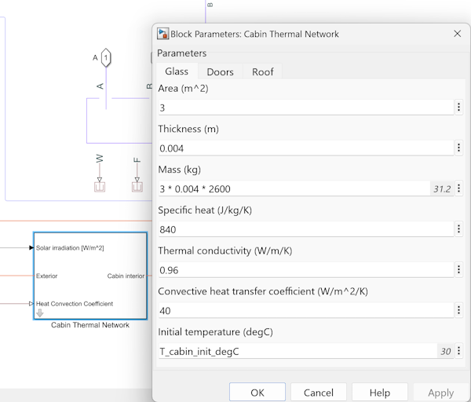

The following figure shows the thermal network for the vehicle cabin. Note that the forced heat convection coefficients on the cabin outside surface depend on the vehicle speed. Roof is additionally heated by sun irradiation.


```matlab
cabin_L = 2; % [m] cabin length
cabin_W = 2; % [m] cabin width
cabin_H = 1.5; % [m] cabin height
T_cabin_init = 30; % [degC] Initial cabin temperature
RH_cabin_init = 0.5; % Initial cabin relative humidity
door_area = 0.5; % [m^2] Door area 
```

### Air Fans

These are the Condenser, Evaporator, and Coolant Radiator fans.

Condenser and evaporator fans are modelled with a variant subsystem, having two levels of fidelity:  

1. Simple fan model, using a volumetric mass flow rate block
2. Detailed fan model, using the [Fan (MA)](https://www.mathworks.com/help/hydro/ref/fanma.html) block available from Simulink<sup>TM</sup> Fluids<sup>TM</sup> product.

```matlab
air_density = 1.225; % [kg/m^3] at standard conditions
VolFlowrate_CondenserFan = condenser_air_massflowrate/air_density;% [m^3/s]
RPM_CondFan = 3000; % [rpm]
VolFlowRate_EvapFan = evap_air_massflowrate/air_density;% [m^3/s]
RPM_EvapFan = 3000; % [rpm]
VolFlowRate_CoolantRadiatorFan = 0.5;% [m^3/s]
```

The refrigeration compressor is also modelled with a variant subsystem, however, since it is an important element that can maintain a stable operation of the refrigeration cycle, we will only use the detailed model variant during simulation. For the Condenser, Evaporator, and Coolant Radiator fans we can use the simple model variant. One thing to note here, during operation the refrigerant flow rate is lower bounded to a value slightly bigger than zero. That is why we limit the compressor's minimum speed at 10 rpm. Maintaining a very small non-zero flow rate will enhance simulation robustness. Additionally, since the compressor control is for the moment just a bang-bang control, we use a low-pass filter with a time constant of 2 s to smooth out the compressor on/off command value. This will help the variable-step solver take larger steps during simulation. Such input smoothing is used for other system actuators as well, enabling faster model initialization and simulation.


## Chiller for Coolant Circuit

The chiller is a heat-exchanger that functions as an evaporator, and which couples the refrigerant loop's two-phase fluid domain with the water-based coolant circuit, modelled using thermal liquid Simulink<sup>TM</sup> domain. The two-phase fluid parameters are the same as the ones used for the HVAC evaporator, if needed they can be adjusted to resize the system. The thermal liquid nominal mass flow rate is calculated based on the coolant pump displacement, see further down for calculation.

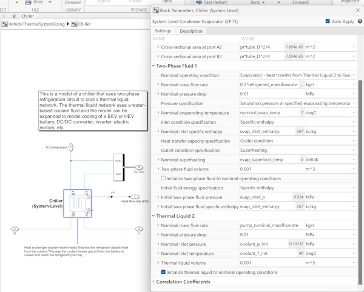

Just like the evaporator, the chiller refrigerant flow is also controlled with a Thermostatic Expansion Valve (TXV) whose parameters are defined as below:  

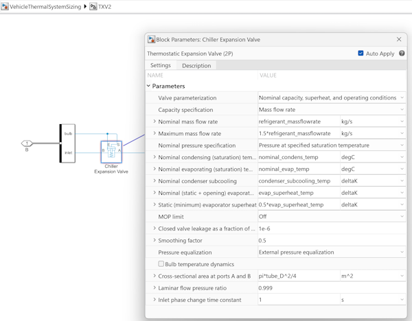

### Coolant Circuit Components

This subsystem models a water-based cooling circuit, that can be used to control the temperature of various electrical devices, such as batteries, DC/DC converters, inverters, motors, etc.  
For the moment, simulation's goal is system-level estimation of the cooling power needed, so the coolant circuit is a simple model. To increase the level of fidelity, the coolant circuit can be interfaced with a more detailed system that includes a BEV or HEV electric components or an ICE (internal combustion engine). This part is out-of-scope for the present example, and the reader can consult MathWorks® documentation, for example [Electric Vehicle Thermal Management](https://www.mathworks.com/help/hydro/ug/sscfluids_ev_thermal_management.html?s_tid=srchtitle_site_search_1_vehicle%20heat%20management).  

To size the thermal system, for the moment we simply assume a heat flow as input. Typically, this is a known quantity that can be easily calculated summing up the various components heat losses.


The heat flow is exchanged with the coolant circuit using a pipe element with parameters defined below:

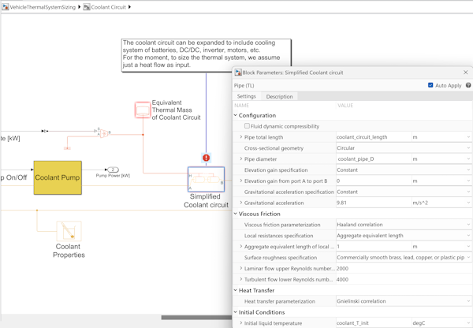

```matlab
coolant_pipe_D = 0.02;  % [m] coolant pipe diameter
coolant_circuit_thermal_mass = 5; % [kg]
coolant_circuit_length = 5; % [m]
```

The coolant circuit also contains a fan radiator that is used to complement the chiller. Radiator fan is modelled as a simple volumetric flow rate source, and radiator_air_mass_flow_rate is assumed to be 1kg/s.

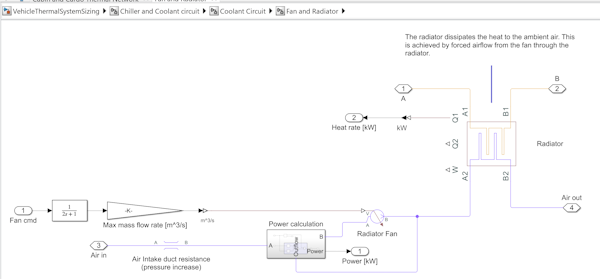

System-level radiator parameters are radiator_cooling_power, radiator_coolant_mass_flow_rate, and radiator_air_mass_flow_rate. 

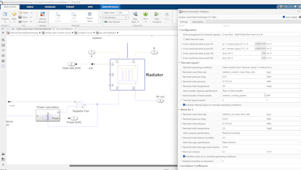

```matlab
radiator_cooling_power = 3; % [kW] radiator cooling power
air_density = 1.225; % [kg/m^3]
radiator_coolant_mass_flow_rate = 1; % [kg/s]
radiator_air_mass_flow_rate = air_density*VolFlowRate_CoolantRadiatorFan; % [kg/s] The [Fixed-Displacement Pump](https://www.mathworks.com/help/hydro/ref/fixeddisplacementpumptl.html?) is parametrized based on its displacement.
```

Coolant pump parametrization is shown below:

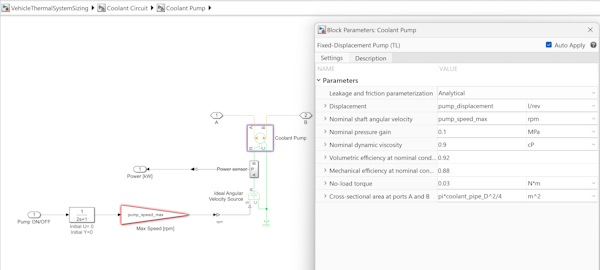

```matlab
pump_displacement = 0.02;   % [l/rev] coolant pump displacement
pump_speed_max = 3000;   % [rpm] coolant pump rpm
coolant_density = 1092; % [kg/m^3] Density of Ethylene Glycol in Solution for Mass Fraction of 0.5
pump_nominal_massflowrate   = pump_displacement*1e-3*(pump_speed_max/60)*coolant_density; % [kg/s] used to parametrize the chiller's thermal fluid nominal mass flow rate
```

Coolant tank is modelled using a [Tank (G-TL)](https://www.mathworks.com/help/hydro/ref/tankgtl.html?) block, which is a pressurized tank with variable gas and thermal liquid volumes.
For simplicity, coolant tank is assumed not to exchange heat with the surroundings (if needed, one can add a simple thermal network to enable heat exchange). Heat exchange with the surroundings can play an important role, since it can be rather large due to high heat convection occurring at higher vehicle speeds.


```matlab
coolant_tank_volume = 5;  % [l] coolant tank capacity
coolant_tank_area = 0.11^2; % [m^2] coolant tank area
```

## Initial Parameters

```matlab
% Environment
T_env = 30; % [degC] External environment temperature
RH_env = 0.5; % External environment relative humidity

moist_air_p_init = 0.101325; % [MPa]
moist_air_T_init = T_env; % [degC]
moist_air_RH_init = RH_env; 

coolant_p_init         = 0.101325;   % [MPa] initial ccolant pressure
coolant_T_init         = 40;         % [degC] initial coolant temperature

% Initial refrigerant condition is set up automatically in the block mask
% using nominal values, if not, uncomment and use below values 
% refrigerant_T_init     = 20; % [degC] initial
% refrigerant temperature
% refrigerant_p_init     = 1.0; % [MPa] initial refrigerant pressure
% refrigerant_alpha_init = 0.76;% initial refrigerant vapor quality
```

We are now ready to run the model. 

## Simulation

We assume a simple test scenario described below:

* Vehicle travels at 50 km/h 
* The passenger cabin temperature is set at 22 ℃ and the surrounding air temperature is 30 ℃. 
* The weather is sunny and there is a sun radiation heat rate of about 170 W/m^2 that heats the cabin roof. Occasionally, a window is opened. 
* There is a 500 W heat flow rate that heats the coolant fluid (mimicking heat flow rate from a battery or electric motors, the value can be freely adjusted within the limits of operating range of the system). This heat rate must be rejected by the coolant circuit.

```matlab
modelName = "VehicleThermalSystemSizing";
open_system(modelName);
```

First, let's investigate the performance of the model using a variable-step solver. 

## Simulation with a variable-step solver

We will first use a variable-step solver for the simulation: [daessc](https://www.mathworks.com/help/simscape/ug/best-practices-for-using-the-daessc-solver.html).
The daessc variable-step Simulink solver provides algorithms specifically designed to simulate differential algebraic equations (DAEs) arising from modeling physical systems.

```matlab
set_param(modelName,SolverName="daessc",MaxStep="1");
% set heat flow rate to the coolant to be 0.5 kW
set_param(modelName+"/Heat flow rate to coolant [kW]", Value = "0.5");
```

To check the model initialization (sometimes there are issues with initialization), first we will enable data logging (in case we need to debug the model), and collect simulation data for the first 20 seconds. We also comment on the p-H diagram, to increase the simulation speed.

```matlab
set_param(modelName,...
    SimscapeUseOperatingPoints = "off",...
    SimscapeLogType = "all", ...
    SimscapeLogName ="simlog_refrigeration",...
    SimscapeLogOpenViewer = "off");

set_param(modelName+"/P-H Diagram", Commented = "on" );

% Simulate the model for 20 seconds.
out = sim(modelName, StopTime = "20");
```

The initialization time is not long and results looks good but the first few seconds of the simulation are slow, indicating that the variable-step solver needs to take very small steps.
This may cause issues when trying to solve the model with a fixed-step solver, we will discuss this issue later.

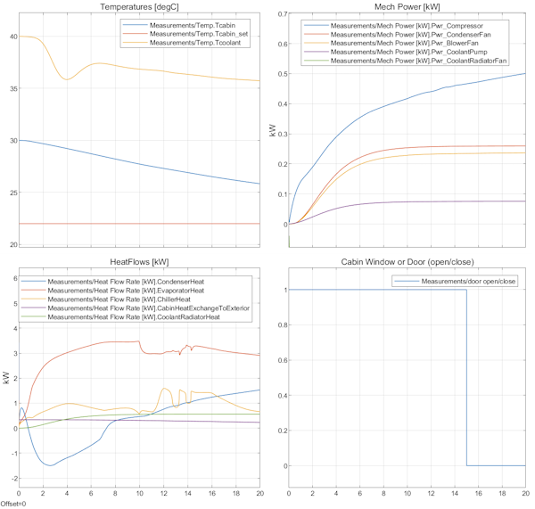

Next, simulate the model for 300 seconds.

```matlab
out = sim(modelName, StopTime = "300");
```

Once again, the results look good. The thermostat is keeping cabin temperature around set value of 22 °C and the coolant temperature goes down, which show the chiller and radiator are working. The energy flow rates look realistic. The simulation is stable even if we switch on and off the compressor.

When the compressor is on, condenser heat flow rate is around 3 kW, and the cabin temperature reaches 22 ℃ in approximately 1 min, as specified in the design requirements of the refrigeration loop. The cabin temperature becoming lower than the outside temperature, the heat flow rate exchanged with the exterior reaches almost -500 W, minus sign indicating that the cabin is heated by the hotter environment. Coolant temperature at steady-state is around 31 ℃.


Let's see how fast the model is running, by using out.SimulationMetadata.TimingInfo.


Notice that the simulation speed is relatively high, a few times higher than wall clock time.

Next, let's investigate the performance of the model when using a fixed-step solver. 

## Simulation with a fixed-step solver

Such solvers must be used when deploying the model to a real-time target, for instance a Hardware-In-the-Loop (HIL) platform. 
We use the ode1be solver with a step time set to 0.2 seconds. The ode1be solver is a Backward Euler type solver that uses a fixed number of Newton iterations and incurs a fixed computational cost. You can use the ode1be solver as a computationally efficient fixed-step alternative to the ode14x solver.  
Step time is rather big, but we need this for a higher simulation speed. Hopefully the simulation does not become unstable with such a large step.

```matlab
set_param(modelName,SolverName="ode1be", FixedStep = "0.2");
```

To check the model initialization, first we will enable data logging (for debugging), and collect simulation data for the first 20 seconds.

```matlab
set_param(modelName,...
    SimscapeUseOperatingPoints = "off",...
    SimscapeLogType = "all", ...
    SimscapeLogName = "simlog_refrigeration",...
    SimscapeLogOpenViewer = "off");

% Simulate the model for 20 seconds.
out = sim(modelName, StopTime = "20");
```

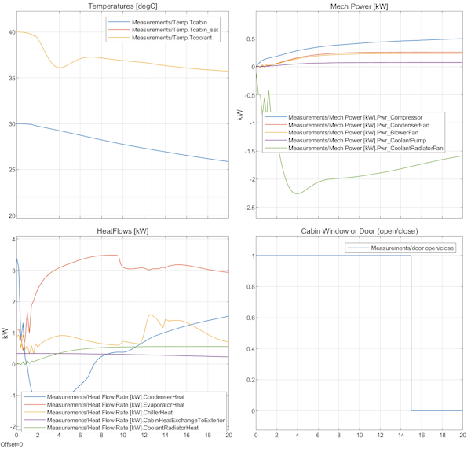

**This time the simulation speed for the first few time steps is very low!**  :disappointed_relieved:

This was indicated as a potential issue when we have run with the variable step solver.  
Notice that there are some initial transients in the first second when using the fixed-step solver, indicating possible instability or numerical issues. We may try to look at the initial parameters and see if there is any problem, or try to lower the step time - but this will slow down the simulation speed. We will pursue a different approach.

Another solution is to use a [Simulink.op.ModelOperatingPoint](http://simulink.op.modeloperatingpoint/) object and use it to initialize the model before another simulation run.   
Here is an example how to do this.  
Create an operating point from logged simulation data at 1 seconds after the start of simulation:

```matlab
% Create an operating point from logged simulation data at 1 seconds after the start of simulation:
in1 = Simulink.SimulationInput(modelName);
in1 = setModelParameter(in1,StartTime="0",StopTime="1",SaveFinalState="on",SaveOperatingPoint="on");

out1 = sim(in1);
```

Next, enable model initialization, using final state **out1.xFinal**, and run the simulation from 1 s to 300 s:

```matlab
% Enable model initialization using final state out1.xFinal, and run the simulation from 1 s to 300 s
in2 = Simulink.SimulationInput(modelName);
in2 = setModelParameter(in2,StopTime="300");
in2 = setInitialState(in2,out1.xFinal);

% Run the simulation from 1 s to 300 s
% Note that the initial condition is inherited from the operating point
% used (for instance the initial coolant temperature is not 40 degrees but
% slightly lower).
out2 = sim(in2);
```

The simulation starts immediately and the model runs pretty fast!  :relieved:  
:warning: Notice the simulation starts at 1 s and not 0 s.  

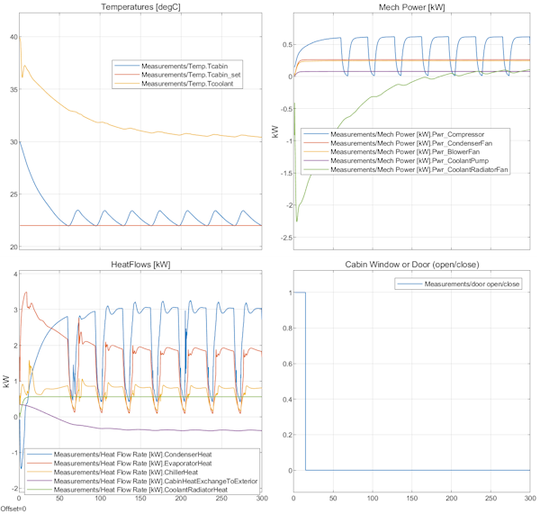

Let's check the execution time.  

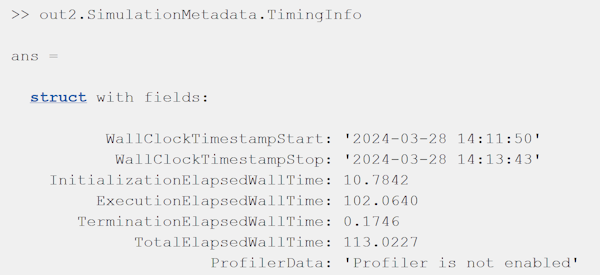

Results indicate that the model runs at almost 3x faster than wall clock time, so with some care it may run on real-time on a HIL system. :thumbsup:
:warning: Note that Simulink<sup>®</sup> cannot load the initial operating point if the model was changed after the operating point was saved. Run the simulation again and resave the operating point.

Next, let's try to see what happens if the heat flow rate from the electrical components (battery, motors, etc.) is changed from 0.5 kW to 2 kW.

```matlab
% Enable model initialization using final state out1.xFinal, and run the simulation from 1 s to 300 s
in2 = Simulink.SimulationInput(modelName);
in2 = setModelParameter(in2,StopTime="300");
in2 = setInitialState(in2,out1.xFinal);

% Modify the heat flow rate that affects the coolant temperature
in2 = setBlockParameter(in2,modelName+"/Heat flow rate to coolant [kW]",Value="2");

% Run the simulation from 1 s to 300 s
out2 = sim(in2);
```

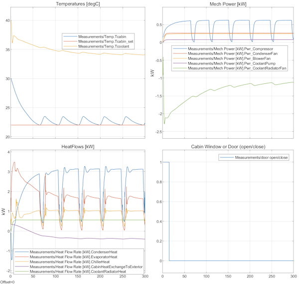

This time the coolant temperature is higher than before, as expected due to the higher rate of input heat flow. However, the chiller and radiator fan maintain a coolant temperature of about 34 ℃, and the refrigeration system can still keep the cabin cool.

## Conclusions

What have we shown in this demo?   
We have shown how to build a system-level digital twin for a vehicle thermal management system.

* We have started by designing a generic refrigeration loop using basic thermodynamic principles
* We expanded the model to regulate the temperature of a cabin and added an additional water-based cooling network, thus creating a system-level thermal management model for a vehicle
* We investigated simulation speed and how to solve model initialization issues using model state

:warning: Based on the energy flow considerations, you may need to adjust the cooling power of the thermal system to match your downstream coolant-based circuit, or to increase the cooling rate for faster cabin cooling, or to satisfy cost vs. performance design constraints. This is where such system-level models come in handy, enabling detailed yet fast what-if scenarios!

## Dependencies

MathWorks products needed to run the simulation are listed below:

1. MATLAB<sup>®</sup> version R2023b
2. Simulink<sup>®</sup>
3. Simscape<sup>TM</sup>
4. Simscape<sup>TM</sup> Fluids<sup>TM</sup>

## Contact

Please write to [Florin Nae](mailto:fnae@mathworks.com) with any questions or suggestions.

## License

The license used in this contribution is the XSLA license. Refer to LICENSE for more information.

*Copyright 2024 The MathWorks, Inc.*
